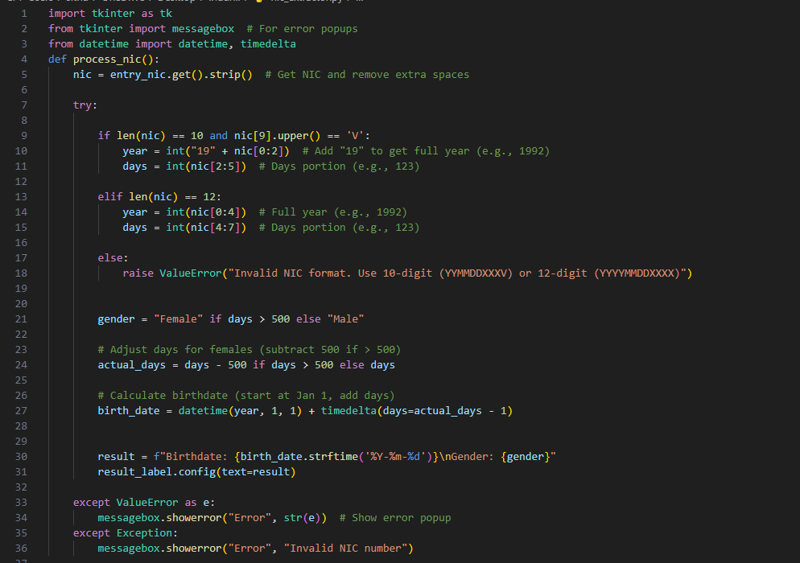

# NIC Information Extractor

A simple Python application built with Tkinter to extract birthdate and gender from Sri Lankan National Identity Card (NIC) numbers. 



## Features
- Supports both old (10-digit) and new (12-digit) Sri Lankan NIC formats.
- Extracts birthdate and gender from the NIC number.
- Displays results in a user-friendly GUI.
- Includes input validation with error messages for invalid NICs.

## NIC Formats Supported
- **Old Format**: `YYMMDDXXXV` (e.g., `921231234V`)
  - Birth year prefixed with "19" (e.g., 1992).
  - Gender: Days > 500 = Female, else Male.
- **New Format**: `YYYYMMDDXXXX` (e.g., `199212312345`)
  - Full birth year included.
  - Gender: Days > 500 = Female, else Male.

## Prerequisites
- Python 3.x installed ([Download Python](https://www.python.org/downloads/)).
- No external libraries required beyond Python's standard library (`tkinter` and `datetime` are included).

## Installation
1. Clone the repository:
   ```bash
   git clone [https://github.com/your-username/nic-extractor.git](https://github.com/sithumbuddhika2002/NIC-numbers-to-show-birthdate-and-gender-.git)
